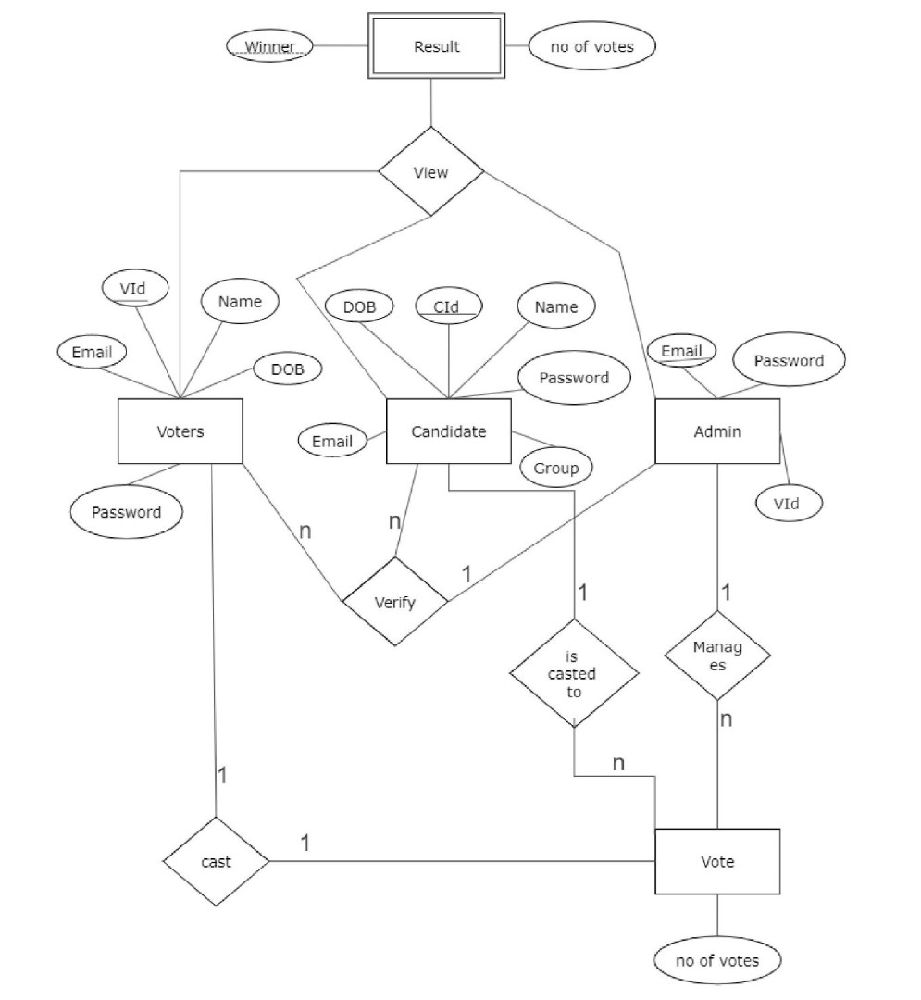
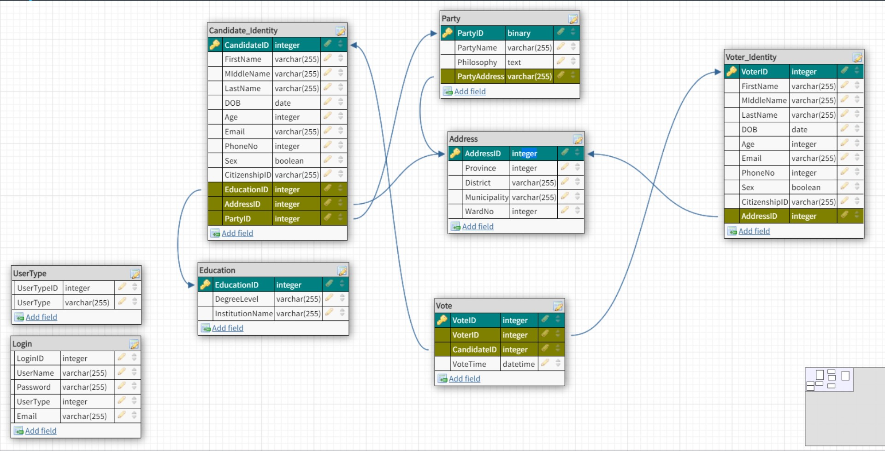

# Digital Voting System

This is a project that at a very basic level implements how online voting can be performed. The project was done to understand the concepts of database management system and database design.

The ER diagram for the project is given below.

The normalised relational schema for the project is given below.

The project uses MySQL as database and Flask for the backend.
